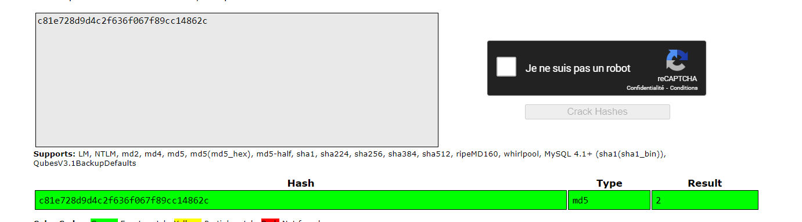

# DVWA WEB 

## Installation du LABO 

### Le github :  https://github.com/digininja/DVWA.git

#### Intallation :  

    git clone https://github.com/digininja/DVWA.git
    cp config/config.inc.php.dist config/config.inc.php
    sudo mv DVWA /var/www/html
    apt install mariadb-server
    apt install apache2
    apt install mysql
    systemctl start apache2
    systemctl start mariabd
    systemctl start mysql

 Accéder à l’application **http://localhost/DVWA/**

#### Configuration 

Sur la page **http://localhost/DVWA/setup.php**

Faire passer en **Enable** tout les checks de l'installation : 

Modifier le /etc/php/8.2/apache2/php.ini

Ajouter les droits au compte www-data

    chown +x www-data /var/www/html/DVWA/hackable/uploads/
    chown +x www-data /var/www/html/DVWA/config

Les 2 parramètres sont utile pour les erreurs et n'impact pas la réalisation du LAB. De plus dans le lab nous n'utiliserons pas le captcha.

Création des bases de données : 
        
        
        mysql> create database dvwa;
        Query OK, 1 row affected (0.00 sec)

        mysql> create user dvwa@localhost identified by 'p@ssw0rd';
        Query OK, 0 rows affected (0.01 sec)

        mysql> grant all on dvwa.* to dvwa@localhost;
        Query OK, 0 rows affected (0.01 sec)

        mysql> flush privileges;
        Query OK, 0 rows affected (0.00 sec)

Connexion à la page login.php

Utilisateur : **admin**  
Mot de passe :  **password**

Modification du niveau :  

## Début  des tests

### Brute force : **http://localhost/DVWA/vulnerabilities/brute/**

#### Niveau de diffuculté: LOW

#### Utilisation de Burpsuite 

Interception d'un requête 

On remarque un get avec des variables  :username=test&password=test&Login=Login

On va créer une variable grâce à l'intruder pour le chant password

On créer une varible puis on ajoute un dictionnaire ou des mots des mots de passe dans le **payload settings**

On lance l'attaque avec le bouton start attack

On remarque dans la requête valide la page qui signifique que nous sommes connecté

#### Niveau de diffuculté: Medium

J'utilise Hydra : 

Il est nécessaire de spécifier les cookies de session des pages(bypasse de la connexion page login.php) 

Dans cet exemple hydra n'est pas capable de retrouver la sortie, il serait utile d'utiliser **:S=area admin** pour qu'il détecte le bon mot de passe.Pour cela il faudrait connaitre le contenue de la page avec le bon mot de pass.

#### Niveau de diffuculté: High

Utilisation d'un script : 

Il vérifie si Welcome est contenu dans la page une fois les identifiants testés.

----
### Commande injection :**http://localhost/DVWA/vulnerabilities/exec/**

#### Niveau de diffuculté: LOW

J'utilise le | qui permet de séparer la commande 

Possibilité d'injecter dans Burpsuite la valeur  : ip=8.8.8.8+%7C+whoami&Submit=Submit

#### Niveau de diffuculté: Medium

Le pipe (|)fonctionne toujours 

#### Niveau de diffuculté: High

Le double pipe (||) fonctionne toujours

--------
### CSRF : 

Si on envoie la requêtes à un utilisateur cela changera son mot de passe par celui dans la requêtes .

password_new=password&password_conf=password&Change=Change
( le cookie de session doit déjà être en place sur la machine cible, il aura un nouveau de passe, et on pourra se connecter)

#### Niveau de diffuculté: High

        <html>
         <body>
         
TOTALLY LEGITIMATE AND SAFE WEBSITE 

        <iframe id="myFrame" src="http://localhost/vulnerabilities/csrf" style="visibility: hidden;" onload="maliciousPayload()"></iframe>
        
        </body>
    </html>

-------
### File inclusion : **http://localhost/DVWA/vulnerabilities/fi/?page=include.php**

#### Niveau de diffuculté: low

J'utilise l'url pour chercher un flag, la partie **?page=** permet de d'afficher des dossiers 

Il est possible de spécifier ce que l’ont souhaite comme ../(7fois)/etc/passwd ou un url malveillant 

#### Niveau de diffuculté: Medium et High

Utilisation de **?page=file** qui permet d'identifier les fichiers 

---------------------------
### SQL Injection : http://localhost/DVWA/vulnerabilities/sqli/

#### Niveau de diffuculté: low,medium

Modification de la requêtes avec burpsuite, j'utilise une condition or 1=1 puis une commande sql qui permet de récupérer les utilisateurs et les mots de passe de la table users

**id=1 or 1=1 UNION SELECT user, password FROM users#&Submit=Submit**

#### Niveau de diffuculté: High

Avec burpsuite j'utilise un **'** pour arreter la commande et je place une requête sql 

----
### Weak Session ID :  http://localhost/DVWA/vulnerabilities/weak_id/

#### Niveau de diffuculté: Low 

Je remarque que l'ID de session s'incrémente de 1 à chaque clic sur le bouton Generate.
Exemple avec 1 clic, session numéro 2

#### Niveau de diffuculté: Medium
Pour le medium c’est en fonction du temps

Puis 39 seconds plus tard : 

On remarque un écart de 39 entre les 2 valeurs (1701727820-1701727781=39)

#### Niveau de diffuculté: High

On remarque un hash 

 
Je clique sur Generate puis j'utilise crackstation 

Je remarque le nombre 2

je remarque le nombre 5

J'en déduit que les sessions sont le hash md5 d'une incrémentation de 1.

--------
### XSS Stored

#### Niveau de diffuculté: High
Voici la requête de base :

On remarque rapidement que le content-lenght est faible, je regarde si je peux augmenter sa taille : 

J’arrive facilement en mettant un content-lenght à 7000 à augmenter la taille du champ Name (initialement bloqué à 7 caractères).Maintenant je vais injecter un payload, je décide de tester d’injecter une image.Avec une balise < img src=testinjectionimage >

J’inspecte la page et je remarque que l’image est bien la donc je vais pouvoir mettre une image qu’y n’existe pas et essayer de faire exécuter un document.cookie.  
Un exemple: 

J’ai mis un gros content-lenght car j’ai beaucoup écrit dans ma balise image.

Cela fonctionne: 
< img src=testxssstored  onerror="alert(document.cookie)">
Sans oublié de rajouter de la content-lenght

-------
### XSS Reflected
#### Niveau de diffuculté: High

La taille du champ n’est pas définit :

Je peux écrire beaucoup de caractères

J’utilise comme pour le xss stored, le même payload qui fonctionne sans burp < img src=testreflected onerror="alert(document.cookie)"> 

----
### XSS DOM
#### Niveau de diffuculté: High
Je remarque que je peux utiliser le ?default= pour modifier la balise Qui permet de sélectionner la langue

J'essaye une xss connue

